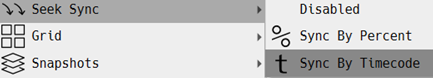
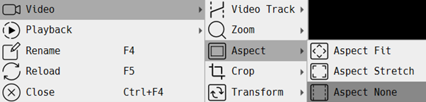
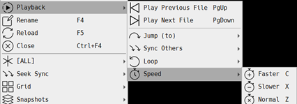
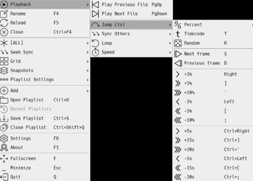

# Echo360 Downloader and Viewer

## Downloading Lectures from Echo360

To download your lectures from Echo360:

1. Clone the downloader tool using:  
   ```bash  
   git clone https://github.com/ronandalton/echo360-downloader.git 
2. Export your course cookies, [Export All Cookies](https://chromewebstore.google.com/detail/get-cookiestxt-locally/cclelndahbckbenkjhflpdbgdldlbecc) using the "Get Cookies.txt" Chrome extension. Place the cookies.txt file in the `echo360-downloader` folder.  
3. Run the main.py file and provide the Echo360 course link when prompted. The script will automatically download all lectures from the course using the cookies.txt file downloaded from (2).  
Lectures will be neatly organized into separate folders, e.g., Lecture 1, Lecture 2, etc.  
  
> To download multiple courses at once, use the terminal:  
    <!-- ```bash -->
    python main.py -o "C:\Users\911BL\OneDrive - University of Canterbury\Lectures 2024\ENME203" -c "ENME203.txt"  
> 
> Make sure to update the course-specific cookies.txt file and output directory accordingly.  

## Watching Downloaded Videos
For dual-source lectures (such as slides and video streams):

Download [gridplayer](https://github.com/vzhd1701/gridplayer) to play both sources of the lecture synchronously.  
+ To play synchronously
<div style="margin-left: 20px;">
  
</div>

+ To view only one source while maintaining sync, double-click on the video you want to make full screen. Double-click again to return to dual view.
 <div style="margin-left: 20px;">
  
</div> 

+ To replicate the view of Echo360, change the aspect ratio to "None".  
<div style="margin-left: 20px;">
 
</div>

+ Keyboard Shortcuts  
<div style="margin-left: 20px;">
 

</div>


